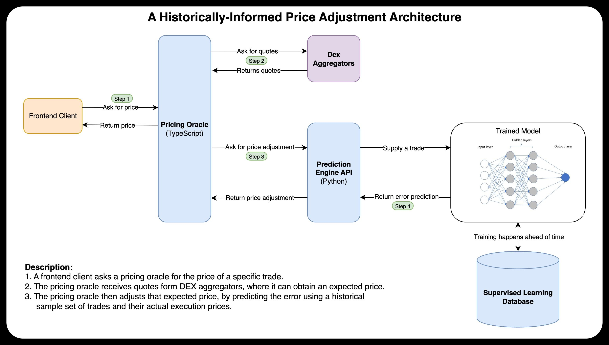

# Price Oracle Estimation System

This repository implements an MVP for a **historically-informed price oracle** for ETH/USDC trades.  
It combines a **TypeScript pricing oracle API** with a **Python prediction engine** backed by a neural network.

See the accompanying [paper (PDF)](./docs/paper.pdf) for the theory behind this service and related ideas.

---

## System Overview

The system is composed of **two services**:

1. **Pricing Oracle (TypeScript)**

    - Accepts trade requests from a frontend client.
    - Queries DEX aggregators (e.g., Odos, 1inch) for raw quotes.
    - Calls the Prediction Engine to adjust those quotes.
    - Returns an ML-adjusted price to the client.

2. **Prediction Engine (Python)**
    - Runs a trained neural network to predict vendor error.
    - Takes a trade quote (with route features like hop count, pool TVL, gas cost).
    - Returns an **adjustment factor** to apply to the quoted price.

**Note**: Both services must be running for the system to work.  
Start the **Prediction Engine** first (port 8000), then the **Pricing Oracle** (port 8080).

---

## Architecture



---

## Services

### 1. Pricing Oracle (TypeScript)

**Installation**

```bash
cd ./oracle
npm install
cp .env.example .env
```

Edit `.env` with:

```env
ODOS_USER_ADDR=0x...
PREDICTOR_BASE_URL=http://localhost:8000
```

**Run**

```bash
npm run dev   # development
npm start     # production
```

Runs on port `8080`.

**Example Request**

```bash
curl -X POST http://localhost:8080/api/price \
  -H "Content-Type: application/json" \
  -d '{
    "chain_id": 1,
    "input_token": "0xA0b86991c6218b36c1d19D4a2e9Eb0cE3606eB48",
    "output_token": "0x0000000000000000000000000000000000000000",
    "input_token_amount": "100000000"
  }'
```

**Example Response**

```json
{
	"ok": true,
	"result": {
		"vendor": "odos",
		"chain_id": 1,
		"input_token": "0xA0b86991c6218b36c1d19D4a2e9Eb0cE3606eB48",
		"output_token": "0x0000000000000000000000000000000000000000",
		"input_amount": "100000000",
		"output_amount": "23107885228739608",
		"price_raw_usdc_per_eth": 4327527119.427985,
		"adjustment_factor": 0.9966649544239045,
		"price_adjusted_usdc_per_eth": 4313094619.252903,
		"pathId": "450244937a6b783919d7fab0cbc708a7",
		"blockNumber": 23415568
	}
}
```

---

### 2. Prediction Engine (Python)

**Installation**

```bash
cd ./prediction_engine
python -m venv env
source env/bin/activate
pip install -r requirements.txt
```

Ensure that the trained model weights are in the following directory:

```
app/core/prediction/weights/
```

**Run**

```bash
uvicorn app.entrypoints.api.setup:app --port 8000 --reload
```

**Example Request**

```bash
curl -X POST http://localhost:8000/predict \
  -H 'Content-Type: application/json' \
  -d '{
    "vendor_id": "odos",
    "chain_id": 1,
    "input_token": "0xA0b86991c6218b36c1d19D4a2e9Eb0cE3606eB48",
    "output_token": "0x0000000000000000000000000000000000000000",
    "input_amount": "10000000",
    "output_amount_quote": "250000000000000",
    "amount_in_usd": 10.0,
    "quote_gas_usd": 0.10,
    "hop_count": 2,
    "min_pool_tvl_usd": 1000000.0
  }'
```

**Example Response**

```json
{
	"adjustment_factor": 0.9909739446640015,
	"model_version": "vendor-error-mlp.pt"
}
```

---

## Data

**⚠️ Note**: This MVP uses **synthetic training data**.
A production service would require real execution data collected over time.

For details on data generation, see [prediction_engine/app/core/prediction/data/README.md](./prediction_engine/app/core/prediction/data/README.md).

---

## Future Work

-   Explore alternative ML models
-   Fine-tune neural network hyperparameters
-   Collect and incorporate real on-chain execution data
-   Build a validation service to track live prediction accuracy
